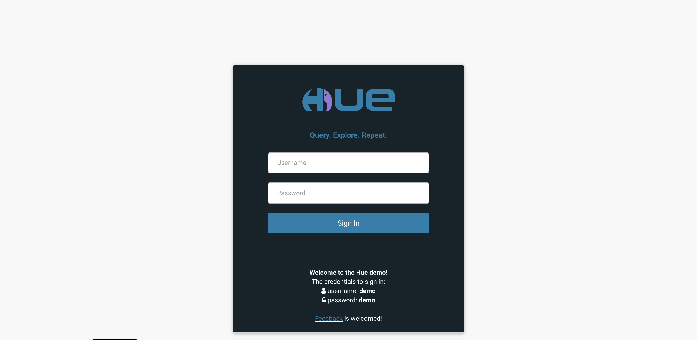

# App2

### I'm practising writing Html & Css. So, I'm taking one target webpage and trying to write it using pure html and css. without using any framework.
### So below are target and my work result.

## Target

## Result

